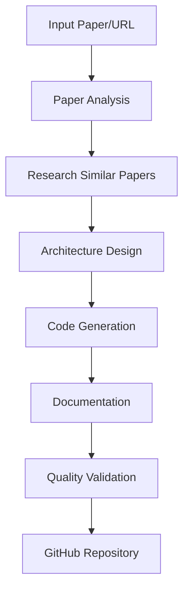

# Agent Development Guidelines

## Project Overview

**Project Name:** Paper2Code - AI-Powered Scientific Paper to Code Implementation Agent

**Goal:** Convert arXiv or similar scientific papers into precise, production-ready code implementations with dedicated GitHub repositories. The agent will generate code that is as accurate or more efficient than the original paper authors' implementations, using subagents to find similar papers with existing code implementations, analyze patterns, and create structured codebases following best practices.

**Key Capabilities:**
- Parse and analyze scientific papers (PDF, arXiv URLs, etc.)
- Extract algorithms, mathematical formulations, and experimental setups
- Find similar papers with existing GitHub implementations
- Generate structured, well-documented code following modern software engineering practices
- Create complete project setups with proper dependencies, testing, and CI/CD
- Generate comprehensive documentation and README files

**Framework:** Agno
**Language:** Python

This project follows LangWatch best practices for building production-ready AI agents.

## System Architecture

The Paper2Code agent will consist of multiple specialized subagents:

1. **Paper Analysis Agent**: Extracts and structures information from scientific papers
2. **Research Agent**: Finds similar papers and existing implementations on GitHub
3. **Code Generation Agent**: Converts paper concepts into executable code
4. **Architecture Agent**: Designs project structure and technology stack
5. **Documentation Agent**: Generates comprehensive documentation
6. **Quality Assurance Agent**: Validates code correctness and performance

## Workflow Process



---

## Essential Commands

### Package Management & Dependencies
```bash
# Install dependencies (using uv - modern Python package manager)
uv sync

# Install development dependencies
uv sync --dev

# Add new dependency
uv add <package-name>
uv add --dev <dev-package-name>
```

### Testing
```bash
# Run all tests with coverage
pytest

# Run tests with verbose output
pytest -v

# Run tests with coverage report (HTML, XML, terminal)
pytest --cov=app --cov-report=html --cov-report=xml --cov-report=term-missing

# Run tests for specific file
pytest tests/scenarios/paper2code_scenario.test.py

# Run specific scenario test
python tests/scenarios/run_scenarios.py paper2code_scenario

# List available scenario tests
python tests/scenarios/run_scenarios.py --list

# Run all scenario tests
python tests/scenarios/run_scenarios.py
```

### Code Quality & Linting
```bash
# Format code with Black
black app/ tests/

# Sort imports with isort
isort app/ tests/

# Run flake8 linting
flake8 app/ tests/

# Run type checking with mypy
mypy app/

# Run all linting tools
black app/ tests/ && isort app/ tests/ && flake8 app/ tests/ && mypy app/
```

### Running the Application
```bash
# Run the main CLI interface
paper2code

# Run with specific arguments (check help for options)
paper2code --help
```

### Development Setup
```bash
# Install pre-commit hooks
pre-commit install

# Run pre-commit on all files
pre-commit run --all-files
```

### Environment Setup
```bash
# Copy environment template
cp .env.example .env

# Load environment variables for development
export $(cat .env | xargs)
```

## Core Principles

### 1. Agent Architecture & Performance

**Critical Performance Rule**: NEVER create agents in loops - reuse them for performance. The Agno framework has significant instantiation overhead.

```python
# WRONG - Recreates agent every time (massive performance hit)
for query in queries:
    agent = Agent(...)  # DON'T DO THIS
    
# CORRECT - Create once, reuse
agent = Agent(...)
for query in queries:
    agent.run(query)
```

**Agent Selection Strategy**:
- **Single Agent (90% of use cases)**: One clear task or domain, can be solved with tools + instructions
- **Team (Autonomous coordination)**: Multiple specialized agents with different expertise, agents decide who does what via LLM
- **Workflow (Programmatic control)**: Sequential steps with clear flow, need conditional logic or branching

**Paper2Code Agent Pattern**: Uses a team of 6 specialized subagents:
1. **Paper Analysis Agent**: Extracts and structures information from scientific papers
2. **Research Agent**: Finds similar papers and existing implementations on GitHub
3. **Architecture Agent**: Designs project structure and technology stack
4. **Code Generation Agent**: Converts paper concepts into executable code
5. **Documentation Agent**: Generates comprehensive documentation
6. **Quality Assurance Agent**: Validates code correctness and performance

### 2. Scenario Agent Testing

Scenario allows for end-to-end validation of multi-turn conversations and real-world scenarios, most agent functionality should be tested with scenarios

**CRITICAL**: Every new agent feature MUST be tested with Scenario tests before considering it complete.

- Write simulation tests for multi-turn conversations
- Validate edge cases
- Ensure business value is delivered
- Test different conversation paths

Best practices:
- NEVER check for regex or word matches in the agent's response, use judge criteria instead
- Use functions on the Scenario scripts for things that can be checked deterministically (tool calls, database entries, etc) instead of relying on the judge
- For the rest, use the judge criteria to check if agent is reaching the desired goal and
- When broken, run on single scenario at a time to debug and iterate faster, not the whole suite
- Write as few scenarios as possible, try to cover more ground with few scenarios, as they are heavy to run
- If user made 1 request, just 1 scenario might be enough, run it at the end of the implementation to check if it works
- ALWAYS consult the Scenario docs on how to write scenarios, do not assume the syntax

### 2. Prompt Management

**ALWAYS** use LangWatch Prompt CLI for managing prompts:

- Use the LangWatch MCP to learn about prompt management, search for Prompt CLI docs
- Never hardcode prompts in your application code
- Store all prompts in the `prompts/` directory as YAML files, use "langwatch prompt create <name>" to create a new prompt
- Run `langwatch prompt sync` after changing a prompt to update the registry

Example prompt structure:
```yaml
# prompts/my_prompt.yaml
model: gpt-4o
temperature: 0.7
messages:
  - role: system
    content: |
      Your system prompt here
  - role: user
    content: |
      {{ user_input }}
```

DO NOT use hardcoded prompts in your application code, example:

BAD:
```
Agent(prompt="You are a helpful assistant.")
```

GOOD:
```python
import langwatch

prompt = langwatch.prompts.get("my_prompt")
Agent(prompt=prompt.prompt)
```

```typescript
import { LangWatch } from "langwatch";

const langwatch = new LangWatch({
  apiKey: process.env.LANGWATCH_API_KEY
});

const prompt = await langwatch.prompts.get("my_prompt")
Agent(prompt=prompt!.prompt)
```

Prompt fetching is very reliable when using the prompts cli because the files are local (double check they were created with the CLI and are listed on the prompts.json file).
DO NOT add try/catch around it and DO NOT duplicate the prompt here as a fallback

Explore the prompt management get started and data model docs if you need more advanced usages such as compiled prompts with variables or messages list.

### 3. Evaluations for specific cases

Only write evaluations for specific cases:

- When a RAG is implemented, so we can evaluate the accuracy given many sample queries (using an LLM to compare expected with generated outputs)
- For classification tasks, e.g. categorization, routing, simple true/false detection, etc
- When the user asks and you are sure an agent scenario wouldn't test the behaviour better

This is because evaluations are good for things when you have a lot of examples, with avery clear
definition of what is correct and what is not (that is, you can just compare expected with generated)
and you are looking for single input/output pairs. This is not the case for multi-turn agent flows.

Create evaluations in Jupyter notebooks under `tests/evaluations/`:

- Generate csv example datasets yourself to be read by pandas with plenty of examples
- Use LangWatch Evaluations API to create evaluation notebooks and track the evaluation results
- Use either a simple == comparison or a direct (e.g. openai) LLM call to compare expected with generated if possible and not requested otherwise

### 4. General good practices

- ALWAYS use the package manager cli commands to init, add and install new dependencies, DO NOT guess package versions, DO NOT add them to the dependencies file by hand.
- When setting up, remember to load dotenv for the tests so env vars are available
- Double check the guidelines on AGENTS.md after the end of the implementation.

---

## Framework-Specific Guidelines

### Agno Framework

**Always follow Agno best practices:**

- Refer to the `.cursorrules` file for Agno-specific coding standards
- Consult `llms.txt` for comprehensive Agno documentation
- Use Agno's agent building patterns and conventions
- Follow Agno's recommended project structure

**Key Agno Resources:**
- Documentation: https://docs.agno.com/
- GitHub: https://github.com/agno-agi/agno
- Local files: `.cursorrules` and `llms.txt`

**When implementing agent features:**
1. Review Agno documentation for best practices
2. Use Agno's built-in tools and utilities
3. Follow Agno's patterns for agent state management
4. Leverage Agno's testing utilities

---

## Project Structure

This project follows a standardized structure for production-ready agents:

```
|__ app/                # Main application code
|   |__ agents/         # Specialized subagents
|   |__ cache/          # Caching system
|   |__ integrations/   # Third-party integrations (e.g., GitHub)
|   |__ models/         # Data models (Pydantic)
|   |__ main.py         # Main orchestrator
|   |__ pipeline.py     # Processing pipeline
|__ prompts/            # Versioned prompt files (YAML)
|_____ *.yaml
|__ tests/
|_____ evaluations/    # Jupyter notebooks for component evaluation
|________ *.ipynb
|_____ scenarios/      # End-to-end scenario tests
|________ *.test.py
|__ prompts.json        # Prompt registry
|__ .env                # Environment variables (never commit!)
|__ pyproject.toml      # Project configuration and dependencies
|__ README.md           # Project documentation
```

---

## Development Workflow

### When Starting a New Feature:

1. **Understand Requirements**: Clarify what the agent should do
2. **Design the Approach**: Plan which components you'll need
3. **Implement with Prompts**: Use LangWatch Prompt CLI to create/manage prompts
4. **Write Unit Tests**: Test deterministic components
5. **Create Evaluations**: Build evaluation notebooks for probabilistic components
6. **Write Scenario Tests**: Create end-to-end tests using Scenario
7. **Run Tests**: Verify everything works before moving on

### Always:

- ✅ Version control your prompts
- ✅ Write tests for new features
- ✅ Use LangWatch MCP to learn best practices
- ✅ Follow the Agent Testing Pyramid
- ✅ Document your agent's capabilities

### Never:

- ❌ Hardcode prompts in application code
- ❌ Skip testing new features
- ❌ Commit API keys or sensitive data
- ❌ Optimize without measuring (use evaluations first)

## Gotchas & Non-Obvious Patterns

- **Agent Reuse is Critical**: Creating agents in loops will severely degrade performance. Always instantiate agents once and reuse them. See `.cursorrules` for examples.
- **Environment Variables**: The application uses `python-dotenv` to load environment variables from a `.env` file. Ensure you have a `.env` file with the necessary API keys and configurations.
- **Caching**: The system uses a caching mechanism in `app/cache/` to avoid re-processing the same papers. Clear the cache if you need to re-run a paper from scratch.
- **Testing**: The project relies heavily on scenario tests in `tests/scenarios/`. When adding new features, it's crucial to add a corresponding scenario test.
- **Package Manager**: This project uses `uv` as the package manager, not `pip`. Use `uv sync` to install dependencies from `pyproject.toml`.

---

## Using LangWatch MCP

The LangWatch MCP server provides expert guidance on:

- Prompt management with Prompt CLI
- Writing Scenario tests
- Creating evaluations
- Best practices for agent development

**How to use it:**
Simply ask your coding assistant questions like:
- "How do I use the LangWatch Prompt CLI?"
- "Show me how to write a Scenario test"
- "How do I create an evaluation for my RAG system?"

The MCP will provide up-to-date documentation and examples.

---

## Getting Started

1. **Set up your environment**: Copy `.env.example` to `.env` and fill in your API keys
2. **Learn the tools**: Ask the LangWatch MCP about prompt management and testing
3. **Start building**: Implement your agent in the `app/` directory
4. **Write tests**: Create scenario tests for your agent's capabilities
5. **Iterate**: Use evaluations to improve your agent's performance

---

## Resources

- **Scenario Documentation**: https://scenario.langwatch.ai/
- **Agent Testing Pyramid**: https://scenario.langwatch.ai/best-practices/the-agent-testing-pyramid
- **LangWatch Dashboard**: https://app.langwatch.ai/
- **Agno Documentation**: https://docs.agno.com/

---

Remember: Building production-ready agents means combining great AI capabilities with solid software engineering practices. Follow these guidelines to create agents that are reliable, testable, and maintainable.
